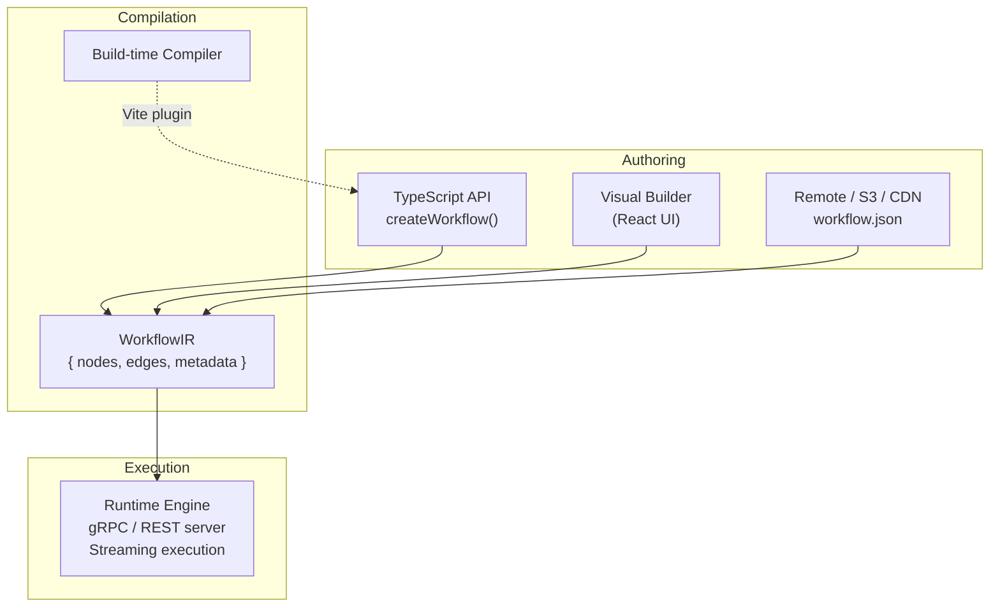

# BrowserMesh

BrowserMesh is a unified browser automation platform where workflows can be authored in TypeScript, a visual node editor, or precompiled JSON — all compiling to a single **WorkflowIR** graph format for deterministic execution.

## Architecture



**The runtime NEVER executes TypeScript or node graphs directly. It ONLY executes compiled JSON workflow graphs.** Everything else is a source that compiles into that format.

## Quick Start

### Code-First Workflow Definition

```typescript
import { createWorkflow } from '@browsermesh/workflow-builder';

const workflow = createWorkflow<{ title: string; prices: string[] }>((wf) => {
  const page = wf
    .createPage()
    .navigate({ url: 'https://books.toscrape.com' });

  const title = page
    .select({ selector: 'h1' })
    .text('title');

  const items = page
    .select({ selector: '.product_pod .price_color' })
    .selectAll();

  const output: { title: string; prices: string[] } = { title: '', prices: [] };

  for (const item of items) {
    output.prices.push(item.text());
  }

  return output;
});
```

### Compilation (Build Time)

The `@browsermesh/compiler` Vite plugin detects `createWorkflow()` calls, evaluates the builder function at build time, and:

1. Emits a sidecar `.ir.json` file containing the compiled graph
2. Rewrites the source module to load the IR at runtime

```typescript
// Compiled output:
import __ir from './workflow.ir.json';
import { createWorkflowLoader } from '@browsermesh/workflow-builder';
export const workflow = createWorkflowLoader(__ir);
```

### Execution

```typescript
// Run with compiled IR
await workflow.run({ endpoint: 'localhost:50051' });

// Run with remote source
await workflow.run({
  source: 'https://cdn.example.com/workflows/scrape.json',
  endpoint: 'localhost:50051',
});
```

## Source Resolution

Any of these source formats resolve to the same `WorkflowIR` at runtime:

| Source | Example |
|--------|---------|
| Compiled sidecar | `workflow.run()` (uses embedded IR) |
| Remote URL | `workflow.run({ source: 'https://cdn/...' })` |
| S3 bucket | `workflow.run({ source: { type: 's3', bucket: '...', key: '...' } })` |
| Inline object | `workflow.run({ source: { type: 'inline', ir: { ... } } })` |
| Local file | `workflow.run({ source: './workflow.ir.json' })` |
| JSON string | `workflow.run({ source: '{"id":"...","nodes":[], ...}' })` |

All converge on `WorkflowIR → Runtime Engine → Streaming Execution`.

## Packages

| Package | Description |
|---------|-------------|
| `@browsermesh/workflow` | Shared types: `WorkflowIR`, node/edge definitions, events |
| `@browsermesh/workflow-builder` | Fluent TypeScript API: `createWorkflow()`, `PageBuilder`, loops |
| `@browsermesh/compiler` | Vite plugin + build-time compiler: TS → `.ir.json` sidecar |
| `@browsermesh/runtime-loader` | Source resolution: URL, S3, inline, local — with IR validation |
| `@browsermesh/sdk` | gRPC client for runtime execution |
| `@browsermesh/ui` | Embeddable React components for visual workflow authoring |
| `apps/runtime` | Standalone gRPC/REST runtime server (Playwright-based) |
| `apps/dashboard` | Dashboard application |

## Development

```sh
pnpm install
pnpm typecheck
pnpm test
pnpm build
```

This repository uses `pnpm` workspaces and Turborepo.

## Design Principles

- **No arbitrary JS execution inside workflows** — only explicit workflow primitives
- **No hidden side effects** — all operations are visible in the graph
- **Deterministic control flow** — loops, conditions, and branches are explicit graph nodes
- **Portable execution format** — workflows can be authored anywhere, executed anywhere
- **Source-agnostic runtime** — the runtime never depends on how the workflow was authored
